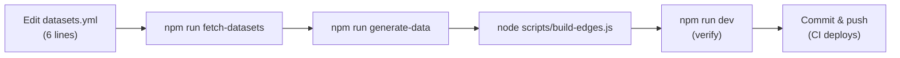

# Adding a Concept Dataset

This guide explains how to add a new terminology dataset to the Glossarist Vocabulary Browser.

## Overview



Adding a dataset requires **zero code changes** — just edit `datasets.yml`.

## Step 1: Add entry to datasets.yml

```yaml
datasets:
  # ... existing entries ...

  - id: my-dataset
    sourceRepo: https://github.com/my-org/my-glossary
    title: "My Glossary Title"
    description: "Description of the terminology dataset"
    owner: My Organization
    existingSiteUrl: https://example.org
    color: "#6366f1"
    tags: [tag1, tag2]
```

Required fields: `id`, `sourceRepo`. Optional: `title`, `description`, `owner`, `existingSiteUrl`, `color`, `tags`.

If `title` is not set, it falls back to the `name` field in the repo's `register.yaml`.

## Step 2: Fetch and harmonize

```bash
npm run fetch-datasets
```

This script:
1. Clones (or updates) the source repo into `.datasets/{id}/`
2. Harmonizes concept YAML files to the canonical format (see `docs/dataset-schema.md`)
3. Extracts inline cross-references into structured `references`

For local development with an existing checkout:
```bash
DATASET_SOURCE_MY_DATASET=/path/to/my-glossary npm run fetch-datasets
```

## Step 3: Generate static data

```bash
npm run generate-data
node scripts/build-edges.js
```

This creates:
```
public/data/my-dataset/
├── manifest.json          ← Dataset metadata
├── index.json             ← Concept listing (id + term + status)
├── edges.json             ← Pre-computed cross-references
├── concepts/              ← Individual concept JSON-LD files
│   ├── 001.json
│   └── ...
└── chunks/                ← For >500 concepts
    └── ...
```

## Step 4: Verify

```bash
npm run dev
```

Check that:
1. The home page shows your dataset card
2. Clicking it shows the concept grid
3. Clicking a concept shows definition, notes, languages
4. Search finds concepts from your dataset

## Step 5: Commit and deploy

```bash
npm test        # verify all tests pass
git add datasets.yml
git commit -m "Add my-dataset"
git push
```

CI/CD automatically fetches, generates, builds, and deploys.

---

## Dataset Requirements

The source repository must contain:

1. `concepts/` directory with YAML concept files (one file per concept)
2. Optionally `register.yaml` with dataset metadata

### Concept YAML format

Concepts must conform to the canonical format defined in `docs/dataset-schema.md`. The harmonization step (in `fetch-datasets`) normalizes common format variants:

- Definitions: bare strings → `[{content: "text"}]`
- Sources: `authoritative_source` → `sources` array
- Dates: scalar fields → `dates` array
- Entry status: `"Standard"` → `"valid"`
- Cross-references: inline `{{term, IEV:xxx}}` → structured `references`

See `docs/dataset-schema.md` for the full specification and `docs/gcr-spec.md` for the GCR packaging format.

---

## Full Pipeline Commands

```bash
# One-command pipeline
npm run build:full

# Or step by step
npm run fetch-datasets      # clone + harmonize
npm run generate-data       # YAML → JSON-LD
node scripts/build-edges.js # cross-reference edges
npm run build               # type-check + vite build + 404.html
```
