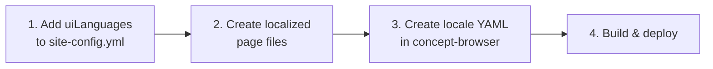

# Adding UI Languages

The concept-browser supports a multilingual user interface — navigation labels, buttons, section headings, and page content can all be translated. The system follows the **open/closed principle**: adding a language requires only a YAML file and a config entry, with zero code changes.

---

## For Site Deployers

### Overview

```
site-config.yml          ← declare available UI languages
about.md                 ← default (English) about page
about-fra.md             ← French about page
```



### Step 1: Declare UI languages

In your `site-config.yml`, add a `uiLanguages` list:

```yaml
uiLanguages:
  - code: eng
    label: English
  - code: fra
    label: Français
```

- `code` — ISO 639-3 language code (must match a locale file in the concept-browser, see below)
- `label` — Display name shown in the language selector dropdown

The language selector dropdown appears in the header automatically when `uiLanguages` contains more than one entry.

### Step 2: Create localized content pages

For each page that should be available in multiple languages, add a `translations` mapping to the page entry:

```yaml
pages:
  - type: about
    route: about
    title: About
    icon: info
    source: about.md
    translations:
      fra:
        title: À propos
        source: about-fra.md
```

The build pipeline generates:
- `pages/about.json` — default (English) content
- `pages/about.fra.json` — French content

At runtime, `PageView.vue` tries the localized version first (based on the selected UI language), then falls back to the default.

### Step 3: Ensure a locale file exists

UI string translations live in the concept-browser package at `src/i18n/locales/{code}.yml`. If a locale file for your language already exists (e.g., `eng.yml`, `fra.yml`), you're done.

If your language is not yet supported, you need to add a locale file — see **For Concept-Browser Developers** below, or file an issue requesting the translation.

### Summary of deployer steps

1. Add `uiLanguages` to `site-config.yml`
2. Create translated page source files (e.g., `about-fra.md`)
3. Add `translations` entries to page configs
4. Ensure the locale YAML exists in the concept-browser
5. Build and deploy

---

## For Concept-Browser Developers

### How the i18n system works

```
src/i18n/
├── index.ts              ← useI18n() composable
└── locales/
    ├── eng.yml           ← English translations
    └── fra.yml           ← French translations
```

1. **Locale YAML files** in `src/i18n/locales/` contain flat `key: value` translation pairs
2. **Vite plugin** (`yamlPlugin` in `vite.config.ts`) transforms `.yml` imports into JS objects at build time
3. **`useI18n()` composable** discovers all locale files via `import.meta.glob('./locales/*.yml')` — no language is hardcoded
4. **Components** call `t('key')` to get the translated string for the current locale

The composable auto-discovers all `.yml` files in `src/i18n/locales/`. Adding a new file is all that's needed to register a language.

### Adding a new built-in language

To add a new language (e.g., Spanish — `spa`):

**1. Create the locale file**

Copy an existing locale file as a starting point:

```bash
cp src/i18n/locales/eng.yml src/i18n/locales/spa.yml
```

**2. Translate all values**

Edit `src/i18n/locales/spa.yml` and translate every value:

```yaml
# Spanish UI translations

# Navigation
nav.home: Inicio
nav.search: Buscar
nav.graph: Vista de grafo
# ... translate all keys ...
```

Do not change the keys (left side), only the values (right side).

**3. Verify**

```bash
npm run dev
```

The new language will be auto-discovered. To test it, add it to a site config's `uiLanguages` or call `setLocale('spa')` in the browser console.

**4. Test**

```bash
npm test
```

All existing tests should continue to pass (translations are not tested in unit tests, only the markdown renderer).

**5. Commit**

```bash
git add src/i18n/locales/spa.yml
git commit -m "Add Spanish (spa) UI translations"
```

### Translation key conventions

Keys follow a `category.item` naming pattern:

| Category | Examples |
|----------|----------|
| `nav.*` | Navigation labels (Home, Search, Graph, etc.) |
| `home.*` | Home page labels (buttons, stats, dataset cards) |
| `search.*` | Search bar and results |
| `page.*` | Static page views (not found, breadcrumbs) |
| `concept.*` | Concept detail (Definition, Notes, Examples, etc.) |
| `sidebar.*` | Sidebar labels |
| `footer.*` | Footer text |
| `header.*` | Header labels |
| `lang.*` | Language-related labels |

To add a new key:
1. Add it to **all** existing locale files (with translated values)
2. Use `t('new.key')` in the component

### Parameterized strings

Some translations include `{name}` placeholders:

```yaml
page.notFoundMsg: 'The page "{name}" does not exist.'
```

Pass parameters as the second argument to `t()`:

```typescript
t('page.notFoundMsg', { name: 'about' })
```

### Localized page build pipeline

The build script (`scripts/generate-data.mjs`) handles page localization:

1. Reads page config from `site-config.yml`
2. Processes the default `source` file → `{route}.json`
3. For each `translations.{lang}`, processes the localized source → `{route}.{lang}.json`

No build script changes are needed when adding new languages — the translation entries in `site-config.yml` drive the pipeline.

### Runtime locale resolution

`PageView.vue` resolves the localized page to display:

```
Given: route = "about", uiLang = "fra"
Try: pages/about.fra.json   ← found, use this
```

```
Given: route = "about", uiLang = "eng"
Try: pages/about.json       ← default, always available
```

If a localized version doesn't exist, it falls back to the default page — so partial translations work gracefully.
