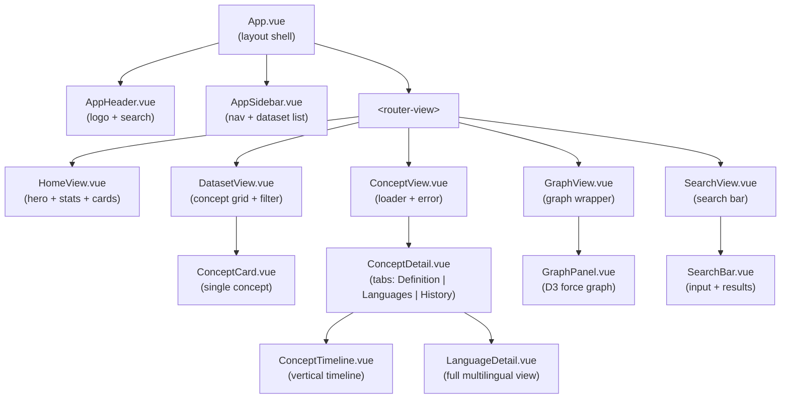
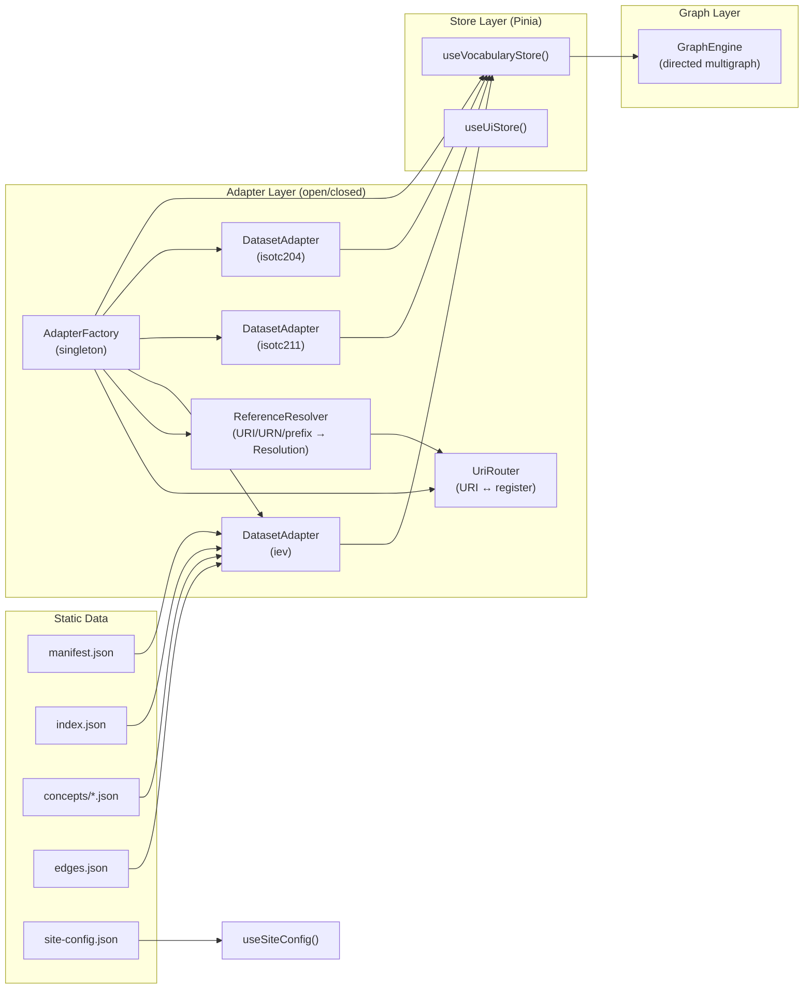
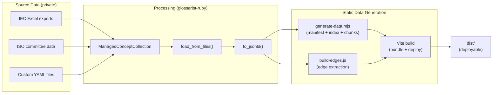

# Glossarist Concept Browser — Architecture Guide

## Overview

The Glossarist Concept Browser (`@glossarist/concept-browser`) is a **statically deployed single-page application** (SPA) for browsing ISO terminology datasets. It renders concepts from multiple terminology registers with full multilingual support, cross-reference graphs, and review history timelines.

Built with **Vue 3 + TypeScript + Vite**, it compiles to static assets deployable to any web host (GitHub Pages, Netlify, S3, etc.). No server runtime is required.

```
┌─────────────────────────────────────────────────────────────────┐
│                    Static Website (dist/)                        │
│                                                                  │
│  index.html ─── app.js ─── app.css                              │
│       │                                                          │
│       ├── public/data/iev/       ← IEC Electropedia (22K terms) │
│       ├── public/data/isotc211/  ← ISO TC 211 (1.3K terms)     │
│       ├── public/data/isotc204/  ← ISO TC 204 (312 terms)      │
│       └── public/data/osgeo/     ← OSGeo Lexicon (444 terms)   │
│                                                                  │
└─────────────────────────────────────────────────────────────────┘
```

---

## System Architecture

### High-Level Data Flow

```mermaid
flowchart TB
    subgraph "Data Preparation (offline)"
        A[datasets.yml] --> B[fetch-datasets.mjs]
        B -->|clone + harmonize| C[.datasets/{id}/concepts/*.yaml]
        C -->|generate-data.mjs| D[JSON-LD concept documents]
        C -->|build-edges.js| E[Edge index files]
        D --> F[manifest.json + index.json]
        D --> G[concepts/*.json]
        F --> H[public/data/{dataset}/]
        G --> H
        E --> H
    end

    subgraph "Build (Vite)"
        G -->|bundled as static assets| H[dist/]
    end

    subgraph "Runtime (Browser)"
        H -->|fetch| I[DatasetAdapter]
        I --> J[Pinia Store]
        J --> K[Vue Components]
        K --> L[User sees concepts, graphs, timelines]
    end
```

### Component Architecture



### Data Layer Architecture



### Resolution Model

All concept references (URIs, URNs, prefixed refs) are resolved through a single unified model:

```typescript
type Resolution =
  | { type: 'internal'; registerId: string; conceptId: string }
  | { type: 'external'; url: string; label: string }
  | { type: 'unresolved'; uri: string };
```

Resolution flow:
1. `AdapterFactory.resolve(uri)` → `ReferenceResolver.resolveUri(uri)`
2. Try `UriRouter.resolveUri()` → internal (loaded dataset)
3. Try `UriRouter.parseUri()` → external template lookup
4. Fallback → unresolved

URN resolution: `urn:iso:std:iso:NNNN:conceptId` → look up NNNN in `urnStandardMap` → get registerId → resolve as above.

Prefix resolution: `IEV:103-01-02` → look up `IEV` in `refPrefixMap` → get registerId → resolve as above.

---

### Hierarchical Sections

Registers can define hierarchical sections in `register.yaml` using the
`children` field. The section tree is serialized verbatim into
`manifest.sections` by `generate-data.mjs` — it is the **single source of
truth** for hierarchy at runtime.

- **Build (`scripts/lib/concept-groups.mjs`):** `getGroups(conceptYaml)`
  produces a concept's direct section memberships. No parent inflation;
  hierarchy is recovered at runtime.
- **Runtime (`src/utils/section-tree.ts`):** pure helpers operate on the
  `SectionNode` tree — `findSectionNode`, `collectDescendantSectionIds`,
  `toSectionNode`, `toSectionTree`. Single definition site for tree
  mapping (previously duplicated in three places).
- **Filtering (`src/views/DatasetView.vue`):** when a user selects a
  parent section, `collectDescendantSectionIds` computes the closure
  once per filter change; the matcher intersects each concept's
  `groups` with the closure. Arbitrary depth works for free.
- **Display (`src/utils/section-display.ts`):** `formatSectionLabel` is
  the single source for the "id — name" disambiguation rule (handles
  EXPRESS-style IDs where `name === id.replace(/_/g, ' ')`).

---

## Adding a New Dataset

New datasets require **zero code changes**. See `docs/adding-a-dataset.md` for the step-by-step guide. The adapter follows the **open/closed principle** — just edit `datasets.yml` and run the pipeline.

### Quick reference

```bash
# 1. Add entry to datasets.yml
# 2. Run pipeline
npm run fetch-datasets && npm run generate-data && node scripts/build-edges.js
# 3. Verify
npm run dev
# 4. Build
npm run build
```

---

## Concept Document Schema (JSON-LD)

Each concept is a JSON-LD document using the `gl:` (Glossarist) vocabulary:

```mermaid
classDiagram
    class ConceptDocument {
        +@context: string
        +@id: URI
        +@type: "gl:Concept"
        +gl:identifier: string
        +gl:localizedConcept: Record~lang, LocalizedConcept~
    }

    class LocalizedConcept {
        +@id: URI
        +@type: "gl:LocalizedConcept"
        +gl:languageCode: string
        +gl:entryStatus: string
        +gl:designation: Designation[]
        +gl:definition: DetailedDefinition[]
        +gl:notes: DetailedDefinition[]
        +gl:examples: DetailedDefinition[]
        +gl:source: ConceptSource[]
        +gl:reviewDate: string
        +gl:reviewDecisionDate: string
        +gl:reviewDecisionEvent: string
        +gl:reviewStatus: string
        +gl:reviewDecision: string
        +gl:reviewDecisionNotes: string
        +gl:dates: ConceptDate[]
        +gl:references: CrossReference[]
        +gl:release: number
    }

    class Designation {
        +@type: string
        +gl:normativeStatus: string
        +gl:term: string
        +gl:gender: string
        +gl:plurality: string
        +gl:international: boolean
    }

    class ConceptSource {
        +@type: string
        +gl:sourceType: string
        +gl:sourceStatus: string
        +gl:modification: string
        +gl:origin: Citation
    }

    class ConceptDate {
        +gl:dateType: string
        +gl:date: string
    }

    class CrossReference {
        +@id: URI
        +gl:term: string
    }

    ConceptDocument --> LocalizedConcept : gl:localizedConcept
    LocalizedConcept --> Designation : gl:designation
    LocalizedConcept --> ConceptSource : gl:source
    LocalizedConcept --> ConceptDate : gl:dates
    LocalizedConcept --> CrossReference : gl:references
```

### Example Concept

```json
{
  "@context": "https://glossarist.org/ns/context.jsonld",
  "@id": "https://glossarist.org/iev/concept/103-01-02",
  "@type": "gl:Concept",
  "gl:identifier": "103-01-02",
  "gl:localizedConcept": {
    "eng": {
      "@id": "https://glossarist.org/iev/concept/103-01-02/eng",
      "@type": "gl:LocalizedConcept",
      "gl:languageCode": "eng",
      "gl:entryStatus": "valid",
      "gl:designation": [
        {
          "@type": "gl:Expression",
          "gl:normativeStatus": "preferred",
          "gl:term": "functional"
        }
      ],
      "gl:definition": [],
      "gl:notes": [
        {
          "@type": "gl:DetailedDefinition",
          "gl:content": "An example of a functional..."
        }
      ],
      "gl:reviewDate": "2009-12-01T00:00:00+00:00",
      "gl:reviewDecisionDate": "2009-12-01T00:00:00+00:00",
      "gl:reviewDecisionEvent": "published"
    },
    "fra": { "...": "..." },
    "deu": { "...": "..." }
  }
}
```

---

## Data Pipeline

### From Source to Deployed Website



### Scripts

| Script | Purpose |
|--------|---------|
| `scripts/fetch-datasets.mjs` | Clones/updates source repos into `.datasets/`, harmonizes concept YAML to canonical format |
| `scripts/generate-data.mjs` | Reads harmonized YAML from `.datasets/`, generates JSON-LD concept documents, manifests, indexes |
| `scripts/build-edges.js` | Reads all concept files, extracts cross-references from `gl:references`, outputs `edges.json` per dataset |
| `scripts/generate-404.js` | Copies `dist/index.html` → `dist/404.html` for GitHub Pages SPA fallback |
| `npx vite build` | Bundles the Vue SPA with all static data into `dist/` |

---

## Key Design Decisions

### 1. Open/Closed Adapter Pattern

New datasets require **zero code changes** — only data files and a registry entry. The `DatasetAdapter` class is parameterized by `registerId` and `baseUrl`. All dataset-specific behavior comes from the data:

```
DatasetAdapter(registerId: "iev", baseUrl: "/data/iev")
DatasetAdapter(registerId: "isotc204", baseUrl: "/data/isotc204")
DatasetAdapter(registerId: "your-new-dataset", baseUrl: "/data/your-new-dataset")
```

### 2. Pre-Computed Edge Index

Cross-reference edges are extracted at build time and stored as `edges.json`. This avoids downloading thousands of concept files at runtime just to find the few that have cross-references.

**Before**: Pre-fetch 22,228 IEV concept files (~110MB) to find 822 with edges
**After**: Load one `edges.json` file (208KB) with all 1,218 pre-computed edges

### 3. Chunked Index for Large Datasets

Datasets with >1000 concepts use chunked indexes (500 concepts per chunk). The lightweight summary index loads at startup for browsing and search. Full concept data loads on demand from individual JSON files.

### 4. Graph Engine with Stub Nodes

The `GraphEngine` creates stub nodes for cross-reference targets that haven't been loaded yet. When a user navigates to a concept, its node is upgraded from stub to loaded with full designations.

### 5. Vue Reactivity with GraphEngine

Since `GraphEngine` is a plain TypeScript class with `Map` internals, Vue's reactivity system can't track mutations. The store uses a `graphVersion` counter incremented via `touchGraph()` after every graph mutation. Computed properties depend on this counter to re-evaluate.

---

## Dataset Reference

| Dataset | Register ID | Concepts | Languages | Edges | Owner |
|---------|-------------|----------|-----------|-------|-------|
| IEC Electropedia (IEV) | `iev` | 22,228 | 12 | 4,369 | IEC TC 1 |
| ISO/TC 211 Multi-Lingual Glossary | `isotc211` | 1,302 | 15 | 0 | ISO TC 211 |
| ISO/TC 204 ITS Vocabulary | `isotc204` | 312 | 1 | 845 | ISO TC 204 |
| OSGeo Lexicon | `osgeo` | 444 | 1 | 0 | OSGeo |

### Cross-Reference Extraction

Cross-references are extracted during the harmonization step (`fetch-datasets.mjs`) from inline patterns in definition/note/example text:
- `{{term name, IEV:103-01-02}}` → `references: [{id: "https://glossarist.org/iev/concept/103-01-02", term: "term name"}]`
- `{urn:iso:std:iso:14812:3.1.1.6,person}` → `references: [{id: "https://glossarist.org/isotc204/concept/3.1.1.6", term: "person"}]`

The cross-reference mapping tables are defined in `datasets.yml` under `crossReferences`.

---

## Technology Stack

| Layer | Technology | Purpose |
|-------|-----------|---------|
| Framework | Vue 3 + TypeScript | Reactive SPA |
| Build | Vite | Fast dev server + production bundling |
| State | Pinia | Centralized store with computed reactivity |
| Routing | Vue Router | SPA navigation |
| Styling | Tailwind CSS | Utility-first design system |
| Graph | D3.js | Force-directed graph visualization |
| Math | KaTeX | LaTeX math rendering (IEV `stem:[...]` notation) |
| Fonts | DM Serif Display + DM Sans + JetBrains Mono | Swiss editorial typography |

---

## File Reference

```
concept-browser/
├── cli/
│   └── index.mjs             ← CLI entry point (fetch/generate/edges/build)
├── public/
│   ├── datasets.json         ← Dataset registry (generated)
│   ├── site-config.json      ← Site branding config (generated)
│   └── data/
│       ├── iev/
│       │   ├── manifest.json
│       │   ├── index.json
│       │   ├── edges.json
│       │   ├── concepts/  (22,228 files)
│       │   └── chunks/    (45 files)
│       ├── isotc211/
│       ├── isotc204/
│       └── osgeo/
├── src/
│   ├── adapters/
│   │   ├── types.ts          ← TypeScript interfaces + Resolution type
│   │   ├── DatasetAdapter.ts ← Data loading + chunked index + edge extraction
│   │   ├── AdapterFactory.ts ← Singleton factory + resolver wiring
│   │   ├── UriRouter.ts      ← URI ↔ register resolution + parseUri()
│   │   └── ReferenceResolver.ts ← Unified URI/URN/prefix resolution
│   ├── config/
│   │   ├── types.ts          ← SiteConfig + SiteBranding interfaces
│   │   └── use-site-config.ts ← Domain-based site config composable
│   ├── graph/
│   │   ├── GraphEngine.ts    ← Directed multigraph with dedup + stub upgrade
│   │   └── index.ts
│   ├── stores/
│   │   ├── vocabulary.ts     ← Main data store (datasets, concepts, graph)
│   │   └── ui.ts             ← UI state (sidebar, language, search)
│   ├── views/
│   │   ├── HomeView.vue      ← Dataset cards (site-config filtered)
│   │   ├── DatasetView.vue   ← Concept grid + pagination
│   │   ├── ConceptView.vue   ← Concept loader
│   │   ├── ResolveView.vue   ← /resolve/{uri} universal deep-link
│   │   ├── SearchView.vue
│   │   ├── GraphView.vue
│   │   ├── StatsView.vue
│   │   └── AboutView.vue
│   ├── components/
│   │   ├── ConceptDetail.vue ← Full concept display with xref resolution
│   │   ├── ConceptTimeline.vue
│   │   ├── GraphPanel.vue    ← D3 force graph
│   │   ├── ConceptCard.vue
│   │   ├── SearchBar.vue
│   │   ├── AppHeader.vue
│   │   └── AppSidebar.vue
│   ├── utils/
│   │   ├── lang.ts           ← Language names + label formatting
│   │   ├── math.ts           ← KaTeX rendering, stem: parsing, xref cleanup
│   │   ├── dataset-style.ts  ← Dynamic dataset colors with caching
│   │   └── index.ts
│   ├── style.css             ← Tailwind layers + custom components
│   ├── main.ts               ← App entry point
│   └── App.vue               ← Root component (skeleton loading)
├── scripts/
│   ├── fetch-datasets.mjs    ← Fetch GCR packages or clone source repos
│   ├── generate-data.mjs     ← YAML → JSON-LD + manifest + site-config
│   ├── build-edges.js        ← Pre-compute cross-reference edges
│   └── generate-404.js       ← SPA fallback for GitHub Pages
├── .github/workflows/
│   └── deploy.yml            ← CI/CD pipeline
├── datasets.yml              ← Dataset registry + cross-ref maps
├── site-configs.yml          ← Per-domain branding config
├── tailwind.config.js
├── index.html
└── vite.config.ts
```
